<!DOCTYPE html>
<HTML>
<HEAD>
	<META charset="UTF-8">
</HEAD>
<BODY>

<H2 id="contents">Study02 README Contents</H2>
<OL>
	<LI><A href="#valid">Research Bean Validation</A>
		<UL>
			<LI><A href="#valid_item">Validation Example "Validate Item"</A></LI>
			<LI><A href="#valid_box">Validation Example "Validate Box Of Items"</A></LI>
			<LI><A href="#valid_method">Validation Example "Validate Method"</A></LI>
		</UL></LI>
	<LI><A href="#c_d_i">Research CDI using Weld SE Container</A>
		<UL>
			<LI><A href="#c_d_i_alternative">CDI Example "Alternative &amp; Qualified Beans"</A></LI>
			<LI><A href="#c_d_i_decorated">CDI Example "Decorated Beans"</A></LI>
			<LI><A href="#c_d_i_intercepted">CDI Example "Intercepted Beans"</A></LI>
			<LI><A href="#c_d_i_events">CDI Example "Events"</A></LI>
		</UL></LI>
	<LI><A href="#r_e_s_t_f_u_l">Research RESTful Web Services using HTTP Server</A>
		<UL>
			<LI><A href="#r_e_s_t_f_u_l_content">RESTful Example "Content GET"</A></LI>
			<LI><A href="#r_e_s_t_f_u_l_boxes_internal">RESTful Example "Boxes CRUD (Internal Client)"</A></LI>
			<LI><A href="#r_e_s_t_f_u_l_boxes_external">RESTful Example "Boxes CRUD (External Client)"</A></LI>
		</UL></LI>
</OL>

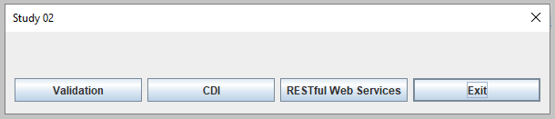 
<I>Screen from "Study 02" main menu.</I>

<H2 id="valid">❶ Research Bean Validation</H2>

Java source code: 
 
 package 
	<a href="https://github.com/ee-eng-cs/Study02/tree/master/src/main/java/kp/valid/">kp.valid</a> 

Action: 
 
 Push button "Validation". 

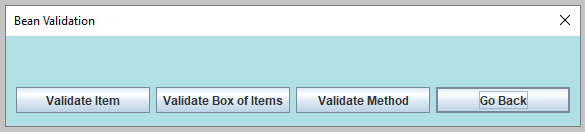 
<I>Screen from "Bean Validation" submenu.</I>

<H3 id="valid_item">Validation Example "Validate Item"</H3>

Action: 
 
 Push button "Validate Item". 

<OL>
	<LI>The interface <B>"ItemCons"</B> has the property-level constraint with pattern ".*Ret". It is placed on the "getVal()" method.</LI>
	<LI>This interface has two implementations: <B>"ItemConsImplNoCons"</B> and <B>"ItemConsImplCons"</B>. 
		Both implementations inherit the constraint from <B>"ItemCons"</B> interface.
		<UL>
			<LI>The implementation <B>"ItemConsImplNoCons"</B> has no constraints in its body.</LI>
			<LI>The implementation <B>"ItemConsImplCons"</B> has new additional constraint defined. 
				This is the field-level constraint with pattern "Fld.*" placed on the "val" field.</LI>
		</UL>
	</LI>
	<LI>In this example there were validated 4 values. These values are presented on tab "Validated Values". 
	Each value was set on new <B>"ItemConsImplNoCons"</B> and on new <B>"ItemConsImplCons"</B> instance.</LI>
	<LI>From the results it is evident what constraints were active in the validation process.
		<UL>
			<LI>Class <B>"ItemConsImplNoCons"</B> has only one: the inherited property-level constraint ".*Ret".</LI>
			<LI>Class <B>"ItemConsImplCons"</B> has two: the inherited property-level constraint ".*Ret" and 
				its own field-level constraint "Fld.*".</LI>
		</UL></LI>
</OL>

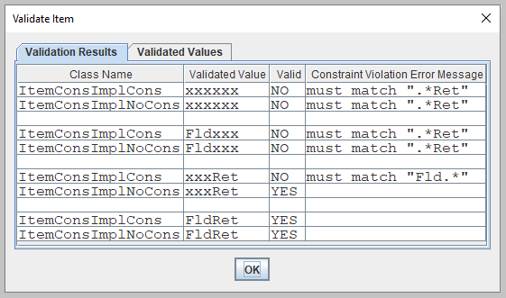 
<I>Screen from "Validate Item" action - tab "Validation Results".</I>

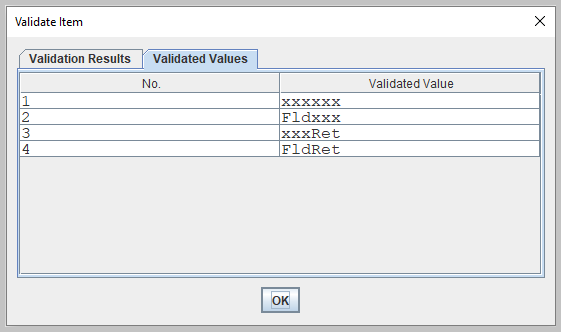 
<I>Screen from "Validate Item" action - tab "Validated Values".</I>

<H3 id="valid_box">Validation Example "Validate Box Of Items"</H3>

Action: 
 
 Push button "Validate Box Of Items". 

<OL>
	<LI>The class <B>"BoxCons"</B> has these constraints:
	<UL>
		<LI>a constraint on the field "list": "Not Null"</LI>
		<LI>a validation cascading on the field "list": 
			validates constraints on the list elements (<B>"ItemConsImplCons"</B> instances)</LI>
		<LI>a constraint on the field "decimal": between minimal value 10 and maximal value 100</LI>
	</UL></LI>
	<LI>In this example there were executed two validations.</LI>
	<LI>In the first validation there were 2 constraint violations: 
		"not null" for "list" equal null and "min value 10" for "decimal" equal 1.</LI>
	<LI>In the second validation there were 4 constraint violations for "list". 
		That list contains 4 <B>"ItemConsImplCons"</B> objects with values presented on tab "Validated Values". 
		The results of that list validation are similar to the results presented in the example "Validate Item" above.</LI>
</OL>

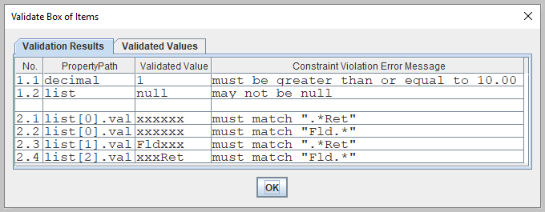 
<I>Screen from "Validate Box Of Items" action - tab "Validation Results".</I>

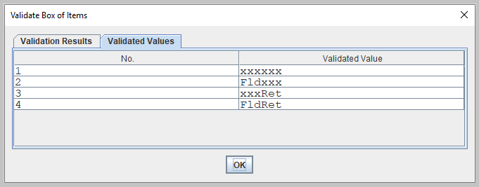 
<I>Screen from "Validate Box Of Items" action - tab "Validated Values".</I>

<H3 id="valid_method">Validation Example "Validate Method"</H3>

Action: 
 
 Push button "Validate Method". 

<OL>
	<LI>The interface <B>"OperCons"</B> has two constraints:
	<UL>
		<LI>a constraint on the method parameter: minimal value 2</LI>
		<LI>a constraint on the method return value: maximal value 1</LI>
	</UL></LI>
	<LI>In this example there were executed four validations:
	<UL>
		<LI>two validations on the method parameter: the first with value 1 and the second with value 2</LI>
		<LI>two validations on the method return value: the first with value 2 and the second with value 1</LI>
	</UL></LI>
	<LI>In the "method parameters" validation there was parameter constraint violation: 
		"min value 2" for parameter equal 1.</LI>
	<LI>In the "method return value" validation there was return value constraint violation: 
		"max value 1" for return value equal 2.</LI>
</OL>

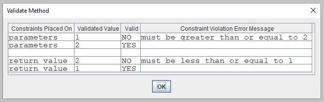 
<I>Screen from "Validate Method" action.</I>

<H2 id="c_d_i">❷ Research CDI using Weld SE Container</H2>

Java source code: 
 
 package 
	<a href="https://github.com/ee-eng-cs/Study02/tree/master/src/main/java/kp/c_d_i/">kp.c_d_i</a> 

Action: 
 
 Push button "CDI". 

The <B>"ResearchCDIBean"</B> runs in a Weld SE container. The <A href="http://weld.cdi-spec.org/">Weld</A> is the reference implementation of CDI. 

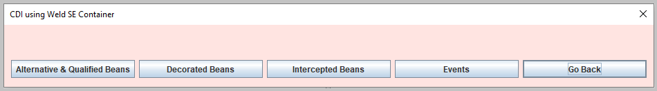 
<I>Screen from "CDI using Weld SE Container" submenu.</I>

<H3 id="c_d_i_alternative">CDI Example "Alternative &amp; Qualified Beans"</H3>

Action: 
 
 Push button "Alternative &amp; Qualified Beans". 

<OL>
	<LI>The interface <B>"BasicBean"</B> has three implementations:
	<UL>
		<LI><B>"BasicBeanImpl"</B></LI>
		<LI><B>"BasicBeanImplAlt"</B> - this is the alternative bean</LI>
		<LI><B>"BasicBeanImplScript"</B> - it uses the qualifier '@Script'</LI>
	</UL></LI>
	<LI>The alternative bean <B>"BasicBeanImplAlt"</B> is enabled in the bean archive descriptor "beans.xml".</LI>
	<LI>The method 'show' in the <B>"BasicBeanImplScript"</B> bean replaces the alphabetic characters with the Unicode script characters.</LI>
	<LI>Here are used two instances of the <B>"BasicBeanImplScript"</B> bean:
	<UL>
		<LI>the 1st is injected with qualifier '@Script'</LI>
		<LI>the 2nd is selected with qualifier '@Script' from injected <B>Instance</B> object</LI>
	</UL></LI>
	<LI>Into <B>"ResearchCDIBean"</B> there were injected three 'foreseeable' strings with '@Foreseeable' qualifier:
	<UL>
		<LI>'foreseeable' using default parameters in the qualifier</LI>
		<LI>'foreseeable' with different date (the 'value' parameter was changed from default 'FAR' to 'NEAR')</LI>
		<LI>'foreseeable' with customized date format (the 'pattern' parameter replaced)</LI>
	</UL></LI>
	<LI>The method 'note' in the <B>"ResearchCDIBean"</B> bean presents those three 'foreseeable' objects.</LI>
</OL>

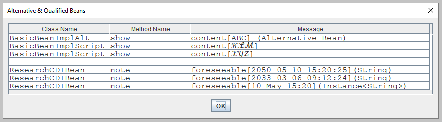 
<I>Screen from "Alternative &amp; Qualified Beans" action.</I>

The same action was repeated with the alternative bean switched off in the file "beans.xml". 
The bean <B>"BasicBeanImplAlt"</B> is replaced with the bean <B>"BasicBeanImpl"</B>.

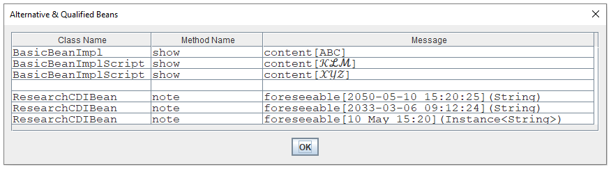 
<I>Screen from "Alternative &amp; Qualified Beans" action with switched off alternatives.</I>

<H3 id="c_d_i_decorated">CDI Example "Decorated Beans"</H3>

Action: 
 
 Push button "Decorated Beans". 

<OL>
	<LI>The interface <B>"PlainBean"</B> has two implementations:
	<UL>
		<LI><B>"PlainBeanImpl"</B></LI>
		<LI><B>"DecoratedBeanImpl"</B> - this is the decorated bean</LI>
	</UL></LI>
	<LI>The decorated bean <B>"DecoratedBeanImpl"</B> is enabled in the bean archive descriptor "beans.xml".</LI>
	<LI>The method 'show' in the <B>"DecoratedBeanImpl"</B> calls the method 'show' from the <B>"PlainBeanImpl"</B> two times:
	<UL>
		<LI>the 1st time with unchanged content</LI>
		<LI>the 2nd time with reversed content</LI>
	</UL></LI>
</OL>

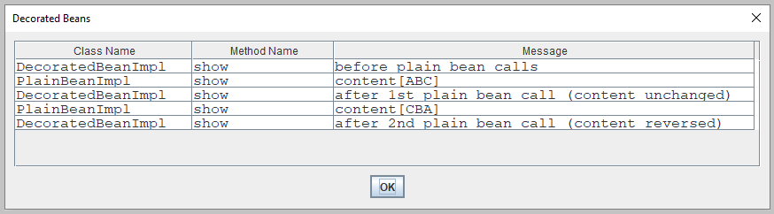 
<I>Screen from "Decorated Beans" action.</I>

The same action was repeated with the decorated bean switched off in the file "beans.xml". 
In the results there is only one single call of the <B>"PlainBeanImpl"</B> bean.

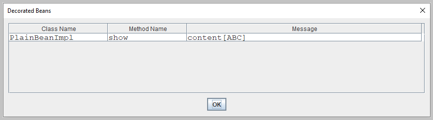 
<I>Screen from "Decorated Beans" action with switched off decorators.</I>

<H3 id="c_d_i_intercepted">CDI Example "Intercepted Beans"</H3>

Action: 
 
 Push button "Intercepted Beans". 

<OL>
	<LI>The interceptor class <B>"ElapsedInterceptor"</B> is enabled in the bean archive descriptor "beans.xml".</LI>
	<LI>This interceptor computes in the method 'measure' the execution time of the bean <B>"ElapsedBean"</B> methods.</LI>
	<LI>The bean <B>"ElapsedBean"</B> has four methods:
	<UL>
		<LI>method 'notPaused' - runs without any pause (empty method without any body)</LI>
		<LI>method 'pausedNano' - pauses one nanosecond</LI>
		<LI>method 'pausedMicro' - pauses one microsecond</LI>
		<LI>method 'pausedMilli' - pauses one millisecond</LI>
	</UL></LI>
	<LI>Those four methods were executed in a sequence ten times.</LI>
	<LI>The results show that measuring elapsed time with interceptor was correct only for 'pausedMilli' method.</LI>
</OL>

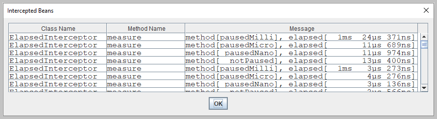 
<I>Screen from "Intercepted Beans" action.</I>

<H3 id="c_d_i_events">CDI Example "Events"</H3>

The CDI advantage: no type erasure for event type.

Action: 
 
 Push button "Events". 

<OL>
	<LI>There were fired three types of events:
	<UL>
		<LI>the 'Payload' event</LI>
		<LI>the 'List&lt;Payload&gt;' event</LI>
		<LI>the 'List&lt;String&gt;' event</LI>
	</UL></LI>
	<LI>The abstract class <B>"BasicObserver"</B> has the method 'showPayload'.</LI>
	<LI>There are two implementations of the <B>"BasicObserver"</B> class: <B>"SmallObserver"</B> and <B>"BigObserver"</B>.</LI>
	<LI>The <B>"SmallObserver"</B> class observes only 'Payload' event in the method 'showPayload'.</LI>
	<LI>The <B>"BigObserver"</B> class observes all three events:
	<UL>
		<LI>the 'Payload' event in the method 'showPayload'</LI>
		<LI>the 'List&lt;Payload&gt;' event in the method 'showPayloadList'</LI>
		<LI>the 'List&lt;String&gt;' event in the method 'showTextList'</LI>
	</UL></LI>
</OL>

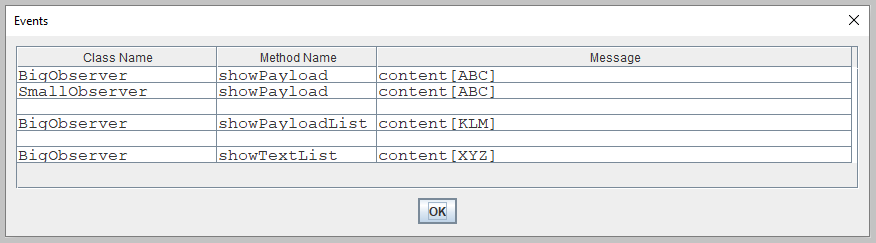 
<I>Screen from "Events" action.</I>

<H2 id="r_e_s_t_f_u_l">❸ Research RESTful Web Services using HTTP Server</H2>

Java source code: 
 
 package 
	<a href="https://github.com/ee-eng-cs/Study02/tree/master/src/main/java/kp/r_e_s_t_f_u_l/">kp.r_e_s_t_f_u_l</a> 

Examples based on <A href ="https://jersey.github.io/documentation/latest/user-guide.html">Jersey User Guide</A>. 

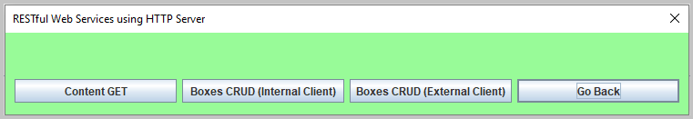 
<I>Screen from "RESTful Web Services using HTTP Server" submenu.</I>

<H3 id="r_e_s_t_f_u_l_content">RESTful Example "Content GET"</H3>

Action: 
 
 Push button "Content GET". 

<OL>
	<LI>The class <B>"ContentClient"</B> gets content from the root resource class <B>"Content"</B> using path and query parameters.</LI>
	<LI>The class <B>"ContentClient"</B> in the method 'process' sends two HTTP requests with URI:
	<UL>
		<LI>No. 1: <I>http://localhost:8080/content/pq/P-a-t-P-a-r?que_par=Q-u-e-P-a-r</I></LI>
		<LI>No. 2: <I>http://localhost:8080/content/c/P-a-t-P-a-r?que_par=Q-u-e-P-a-r</I></LI>
	</UL></LI>
	<LI>The class <B>"Content"</B> has two resource methods with the resource method designator annotation '@GET':
	<UL>
		<LI>the resource method 'getUsingPathAndQuery' uses parameters with type 'String' and annotations '@PathParam' and '@QueryParam'</LI>
		<LI>the resource method 'getUsingContext' uses parameter with type 'UriInfo' and annotation '@Context'</LI>
	</UL></LI>
</OL>

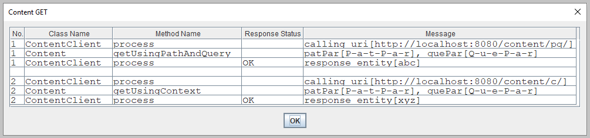 
<I>Screen from "Content GET" action.</I>

<H3 id="r_e_s_t_f_u_l_boxes_internal">RESTful Example "Boxes CRUD (Internal Client)"</H3>

Action: 
 
 Push button "Boxes CRUD (Internal Client)". 

<OL>
	<LI>The class <B>"BoxesClient"</B> sends CREATE, READ, UPDATE, and DELETE requests to the <B>"SetOfBoxes"</B> class.</LI>
	<LI>The requests No. 1, No. 2, and No. 3 create three new <B>"Box"</B> objects.</LI>
	<LI>The resource method 'createBox' validates <B>"Box"</B> and puts the created <B>"Box"</B> in a Map. 
	It is not idempotent because it uses HTTP POST.</LI>
	<LI>The request No. 4 finds <B>"Box"</B> object with id 1. The resource method 'readBox' uses HTTP GET.</LI>
	<LI>The request No. 5 finds all <B>"Box"</B> objects and returns list. The resource method 'readBoxes' uses HTTP GET.</LI>
	<LI>The <B>"Box"</B> object is updated two times in a row (requests No. 6 and No. 7) with the same data: id 1 and text "X".</LI>
	<LI>The resource method 'updateBox' validates <B>"Box"</B> and puts the updated <B>"Box"</B> in a Map. 
	It is idempotent because it uses HTTP PUT.</LI>
	<LI>The request No. 8 deletes <B>"Box"</B> object with id 2. The resource method 'deleteBox' uses HTTP DELETE.</LI>
	<LI>The request No. 9 reads all <B>"Box"</B> objects. 
	Here it is confirmed that <B>"Box"</B> object with id 1 was updated and <B>"Box"</B> object with id 2 was deleted.</LI>
	<LI>The requests No. 10 and No. 11 fail after a validation constraint violation. 
	The validation constraint violation exception returns a response with status code 400 'Bad Request'. 
	Valid are only texts with the upper case characters (annotation @Pattern in the <B>"Box"</B> class).</LI>
	<LI>The requests No. 12 and No. 13 fail because <B>"Box"</B> objects with that id do not exist.</LI>
</OL>

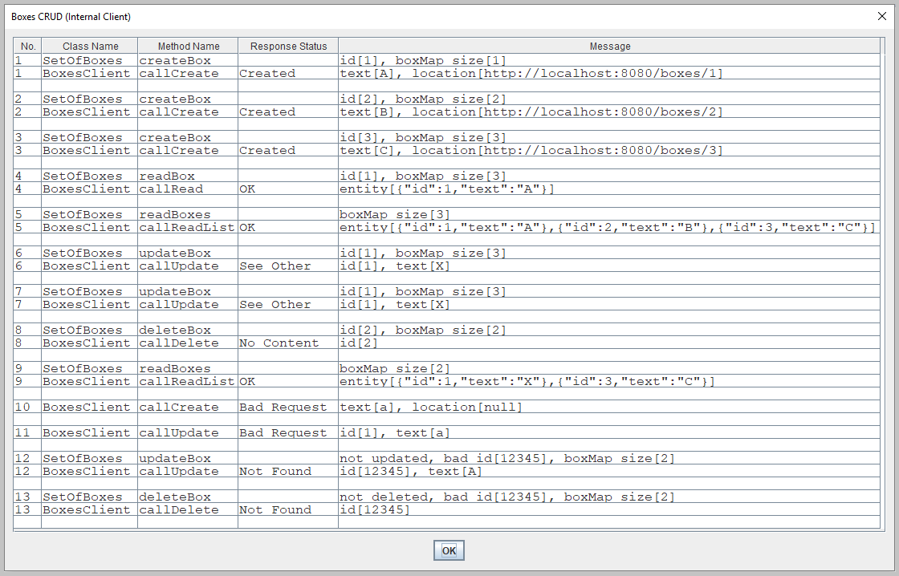 
<I>Screen from "Boxes CRUD (Internal Client)" action.</I>

<H3 id="r_e_s_t_f_u_l_boxes_external">RESTful Example "Boxes CRUD (External Client)"</H3>

Actions: 
 
 1. Push button "Boxes CRUD (External Client)". 
The main application pauses and the HTTP server starts listening for HTTP requests. 
 2. Start batch file <B>"02 call server with curl.bat"</B>. 
This script uses 'curl' for sending HTTP requests: POST, GET, PUT, and DELETE. 
 3. After finished execution of the batch file press button 'Enter' in the main window to shutdown the server. 
The main application resumes running and shows the results in the "Boxes CRUD (External Client)" window. 

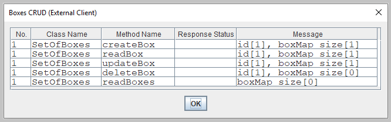 
<I>Screen from "Boxes CRUD (External Client)" action.</I>

<A href="apidocs/index.html?overview-summary.html" >API Specifications</A>
(API was not commited to <B>GitHub</B>; this link should be active after local build with <I>'mvn javadoc'</I>)

</BODY>
</HTML>